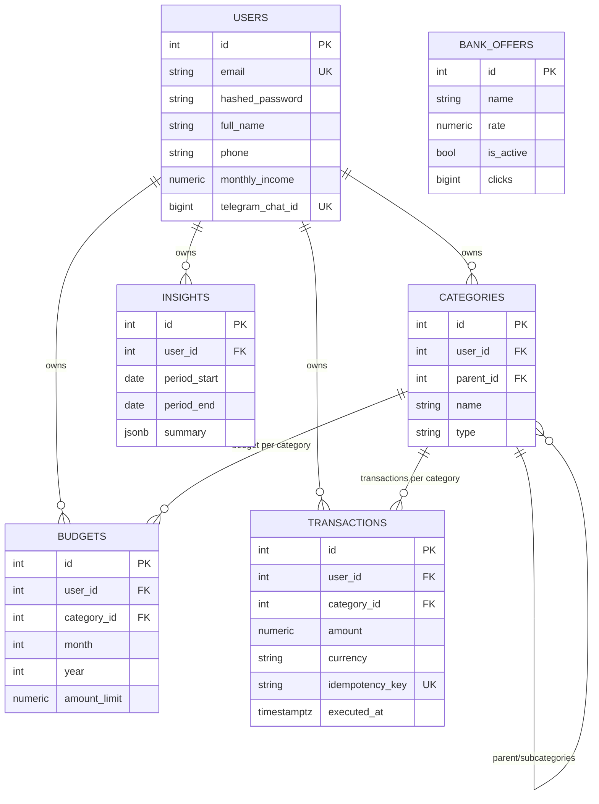

# Схема базы данных

Источник истины: `backend/src/domain/models.py` (SQLAlchemy 2.0 Declarative), применяется через
Alembic-миграции в `backend/migrations/versions/`. Все денежные поля — `NUMERIC`, без float.

## Таблицы

### `users`

| Поле | Тип | Nullable | Default | Индекс/ограничение |
|---|---|---|---|---|
| id | PK (int) | — | — | PRIMARY KEY |
| email | String(320) | нет | — | UNIQUE |
| hashed_password | String(255) | нет | — | |
| full_name | String(255) | да | — | |
| phone | String(20) | да | — | |
| monthly_income | NUMERIC(12,2) | нет | `0` | |
| telegram_chat_id | BigInteger | да | — | UNIQUE |
| created_at | TIMESTAMPTZ | нет | `now()` | |

### `categories`

| Поле | Тип | Nullable | Default | Индекс/ограничение |
|---|---|---|---|---|
| id | PK (int) | — | — | PRIMARY KEY |
| user_id | FK → users.id | нет | — | ON DELETE CASCADE, индекс |
| parent_id | FK → categories.id | да | — | ON DELETE CASCADE (self-reference, дерево подкатегорий) |
| name | String(128) | нет | — | |
| icon | String(64) | да | — | |
| type | Enum(`category_type_enum`: income/expense) | нет | — | |

### `budgets`

| Поле | Тип | Nullable | Default | Индекс/ограничение |
|---|---|---|---|---|
| id | PK (int) | — | — | PRIMARY KEY |
| user_id | FK → users.id | нет | — | ON DELETE CASCADE, индекс |
| category_id | FK → categories.id | нет | — | ON DELETE CASCADE, индекс |
| month | int | нет | — | |
| year | int | нет | — | |
| amount_limit | NUMERIC(12,2) | нет | `0` | |

- `UNIQUE(user_id, category_id, month, year)` — `uq_budget_user_cat_month_year` (один лимит на категорию в месяц).

### `transactions`

| Поле | Тип | Nullable | Default | Индекс/ограничение |
|---|---|---|---|---|
| id | PK (int) | — | — | PRIMARY KEY |
| user_id | FK → users.id | нет | — | ON DELETE CASCADE, индекс |
| category_id | FK → categories.id | нет | — | ON DELETE CASCADE, индекс |
| amount | NUMERIC(12,2) | нет | — | |
| currency | String(3) | нет | `RUB` | |
| is_recurring | bool | нет | `false` | |
| entry_type | String(32) | нет | `manual` | |
| comment | String(255) | да | — | |
| executed_at | TIMESTAMPTZ | нет | `now()` | |
| idempotency_key | UUID (строка) | да | — | UNIQUE (`uq_transaction_idempotency`) |

- `UNIQUE(idempotency_key)` — последний рубеж защиты от двойной записи (первый — проверка в Redis, см. API_REFERENCE.md).
- `INDEX(user_id, executed_at)` — `ix_transaction_user_executed`, добавлен отдельной миграцией `6825ab5d3032_add_performance_indexes` для ускорения помесячной агрегации.

### `bank_offers`

Партнёрские вклады для Savings Navigator (CPA-монетизация), редактируются через SQLAdmin.

| Поле | Тип | Nullable | Default | Индекс/ограничение |
|---|---|---|---|---|
| id | PK (int) | — | — | PRIMARY KEY |
| name | String(128) | нет | — | |
| rate | NUMERIC(5,2) | нет | — | |
| color | String(16) | нет | `#888888` | |
| partner_url | String(512) | да | — | CPA-трекинговая ссылка |
| is_active | bool | нет | `true` | |
| sort_order | int | нет | `0` | |
| clicks | BigInteger | нет | `0` | funnel-счётчик кликов |
| created_at | TIMESTAMPTZ | нет | `now()` | |

### `insights`

Персистентные LLM-инсайты (месячные/годовые), одна строка на пользователя за период.

| Поле | Тип | Nullable | Default | Индекс/ограничение |
|---|---|---|---|---|
| id | PK (int) | — | — | PRIMARY KEY |
| user_id | FK → users.id | нет | — | ON DELETE CASCADE, индекс |
| period_start | Date | нет | — | |
| period_end | Date | нет | — | |
| advice | Text | нет | — | |
| summary | JSONB | нет | — | |
| model_used | String(64) | нет | — | |
| created_at | TIMESTAMPTZ | нет | `now()` | |

- `UNIQUE(user_id, period_start, period_end)` — `uq_insight_user_period`; повторный запуск анализа делает upsert, месяц не дублируется.

## ER-диаграмма



`bank_offers` не имеет FK-связей с другими таблицами — это независимый справочник для Savings Navigator.

## Миграции (Alembic)

Файлы в `backend/migrations/versions/`, в хронологическом порядке применения:

| Revision | Файл | Назначение |
|---|---|---|
| `001` | `001_initial_schema.py` | Первичная схема |
| `2898dc65dcd1` | `2898dc65dcd1_zen_finance_models.py` | Базовые модели users/categories/budgets/transactions |
| `d05756d8f778` | `..._add_authentication_and_profile_fields_.py` | Поля аутентификации и профиля |
| `a1b2c3d4e5f6` | `..._add_telegram_chat_id_to_users.py` | `telegram_chat_id` для привязки Telegram-аккаунта |
| `be3bb58149d3` | `..._add_monthly_income_to_users.py` | `monthly_income` |
| `6825ab5d3032` | `..._add_performance_indexes.py` | `ix_transaction_user_executed` |
| `efe8619e215d` | `..._add_comment_to_transactions.py` | `comment` в транзакциях |
| `bb95b3b80349` | `..._add_insights_table.py` | Таблица `insights` |
| `87839f63308a` | `..._add_bank_offers_table.py` | Таблица `bank_offers` (в разработке, не закоммичена) |

### Команды

```bash
# Применить все миграции до последней ревизии
docker-compose exec backend alembic upgrade head

# Создать новую миграцию из изменений в models.py
docker-compose exec backend alembic revision --autogenerate -m "описание"

# Откатить последнюю миграцию
docker-compose exec backend alembic downgrade -1
```
