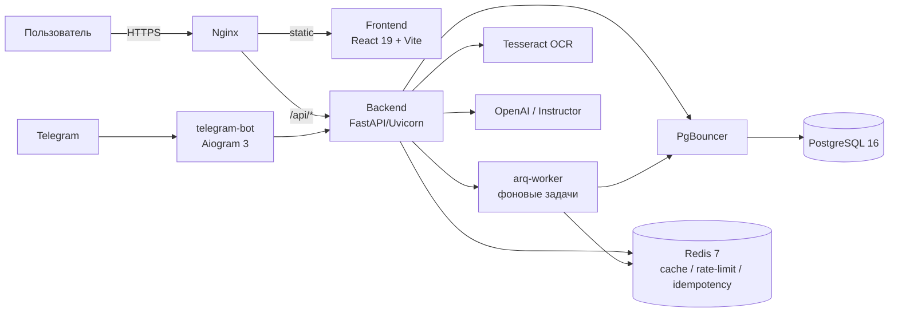

# Проект Citrine Vault (electro-treasur)

## Общее описание

**Citrine Vault** — персональный финансовый трекер с ИИ-ассистентом: распознаёт чеки и банковские
выписки через OCR (Tesseract) и автоматически категоризирует расходы. Состоит из веб-приложения
(React) и Telegram-бота (Aiogram 3), обёрнутых вокруг общего FastAPI-бэкенда.

- Сайт: citrinevault.ru
- Telegram-бот: @citrine_vault_bot
- API-документация (Swagger): `/docs` на бэкенде

## Архитектура и стек

### Backend (`backend/`, Python 3.12)

| Компонент | Технология |
|---|---|
| Web-фреймворк | FastAPI (async, strict Pydantic v2) |
| ORM | SQLAlchemy 2.0 (asyncio) + asyncpg |
| Миграции | Alembic |
| Валидация/настройки | Pydantic v2 + pydantic-settings (переменные с префиксом `ET_`) |
| Аутентификация | python-jose (JWT), Argon2 (argon2-cffi, хеширование паролей в отдельном thread pool) |
| Rate limiting | SlowAPI |
| Фоновые задачи | ARQ (Redis-backed job queue), запускается через `run_arq.py` / `arq-worker` сервис |
| Telegram-бот | Aiogram 3 (`src/infrastructure/telegram`) |
| OCR | Tesseract + Pillow |
| LLM-интеграция | OpenAI SDK + Instructor (умная категоризация, инсайты) |
| Админ-панель | SQLAdmin (`src/admin.py`), проксируется через Nginx `/admin` |
| Агентная подсистема | Собственный оркестратор агентов, см. `backend/src/agents/` |

### Frontend (`frontend/`)

| Компонент | Технология |
|---|---|
| Язык/фреймворк | TypeScript + React 19 (package.json пинит `^19.2.4`) |
| Сборка | Vite 8 |
| Стилизация | Tailwind CSS v3 (glassmorphic UI) |
| Серверный стейт | TanStack Query v5 |
| Роутинг | react-router-dom v7 |
| Анимации | Framer Motion |
| Графики | Recharts |
| Уведомления | sonner |
| Прочее | date-fns, lucide-react (иконки), clsx / tailwind-merge |

### Базы данных и кэши

- **PostgreSQL 16** — основное хранилище (JSONB, NUMERIC(12,2) для денег).
- **PgBouncer** — connection pooling перед Postgres (`transaction` mode, pool size 200, `scram-sha-256`).
- **Redis 7** — кэш, rate-limiting, idempotency keys, брокер очереди ARQ (persist через AOF, `allkeys-lru`, 256mb).

### DevOps и инфраструктура

- **Docker Compose** — `docker-compose.yml` (dev/базовый стек), `docker-compose.prod.yml` (прод),
  `docker-compose.monitoring.yml` (Prometheus/Grafana/Alertmanager/cAdvisor + exporters).
- **Nginx** — reverse proxy, раздача статики фронтенда, отдельные конфиги `nginx.conf` (local) и
  `nginx.prod.conf` (prod, SSL/Let's Encrypt).
- **Kubernetes** (`k8s/`) — манифесты для FastAPI (Deployment + HPA), ARQ worker, PgBouncer.
- **CI/CD** — GitHub Actions: `ruff check` → `ruff format` → `mypy --strict` → `pip-audit` →
  `pytest` (coverage ≥ 70%) → Docker multi-stage build → push в GHCR (только при пуше в `main`).
- **Мониторинг** — Prometheus + Grafana + Alertmanager + cAdvisor/экспортёры (см. `monitoring/`).
- **Нагрузочное тестирование** — Locust (`load_testing/locustfile.py`).

### Сервисы (docker-compose.yml)

| Сервис | Технология | Внутренний порт | Публичный порт |
|---|---|---|---|
| frontend | Nginx + React static build | 80/443 | 80, 443 |
| backend | FastAPI/Uvicorn | 8000 | — (только через nginx `/api/*`) |
| telegram-bot | Aiogram 3 (тот же образ, что backend) | — (нет HTTP-сервера) | — |
| arq-worker | ARQ worker (тот же образ, что backend) | — (нет HTTP-сервера) | — |
| postgres | postgres:16-alpine | 5432 | — |
| pgbouncer | edoburu/pgbouncer | 6432 | 6432 (для локальной отладки) |
| redis | redis:7-alpine | 6379 | — |

## Структура проекта

```
electro-treasur/
├── backend/
│   ├── src/
│   │   ├── admin.py            # SQLAdmin back-office панель
│   │   ├── config.py           # Pydantic Settings (ET_ префикс)
│   │   ├── database.py         # Async engine/session
│   │   ├── dependencies.py     # FastAPI DI (current_user, session, etc.)
│   │   ├── main.py              # FastAPI app entrypoint
│   │   ├── agents/              # Мультиагентная система (см. Фазу 3)
│   │   │   ├── orchestrator.py
│   │   │   ├── base_agent.py
│   │   │   ├── skill_registry.py
│   │   │   ├── agents/backend_agent.py
│   │   │   ├── skills/{file_skills.py, test_skills.py}
│   │   │   └── docs/backend_rules.md
│   │   ├── api/
│   │   │   ├── v1/             # auth, users, transactions, budgets, dashboard,
│   │   │   │                   # analytics, insights, offers, router
│   │   │   └── analytics/yearly.py
│   │   ├── domain/models.py     # SQLAlchemy ORM: User, Category, Transaction, Budget, ...
│   │   ├── schemas/              # Pydantic v2 схемы (insight, offer, ...)
│   │   ├── services/             # Бизнес-логика (OCR, dashboard, auth, ...)
│   │   └── infrastructure/
│   │       ├── telegram/         # Aiogram 3 bot
│   │       └── workers/          # ARQ задачи (cron-инсайты и т.д.)
│   ├── migrations/versions/      # Alembic-миграции
│   ├── tests/{unit,integration,e2e,factories}/
│   └── Dockerfile                # multi-stage builder → runtime
│
├── frontend/
│   └── src/
│       ├── api/                  # API-клиент (TanStack Query)
│       ├── components/{analytics,auth,budgets,dashboard,insights,layout,profile,ui}/
│       ├── context/               # Auth/Theme контексты
│       ├── data/, lib/, types/
│       └── App.tsx, main.tsx
│
├── docker-compose.yml / .prod.yml / .monitoring.yml
├── k8s/                           # Kubernetes-манифесты
├── monitoring/                    # Prometheus/Grafana/Alertmanager конфиги
├── load_testing/locustfile.py
└── docs/                          # Эта документация
```

## Взаимодействие сервисов



## Важные правила (для разработки)

- Все запросы к БД — асинхронные (`AsyncSession`, `asyncpg`), денежные суммы — `NUMERIC(12,2)`.
- `mypy --strict` включён для `src/` (кроме `migrations/`, `tests/`); Pydantic-модели типизированы через `pydantic.mypy` плагин.
- Линтинг — `ruff` (line-length 99, правила `E,F,I,UP,B,SIM`).
- Idempotency Keys обеспечиваются на уровне PostgreSQL (UNIQUE constraint) — критично для батч-импорта и повторных Telegram-запросов.
- Тесты изолируются через вложенные Savepoints, а не пересоздание БД — подробности в `backend/tests/TESTING.md`.
- Переменные окружения — только через `.env` с префиксом `ET_`, никогда не хардкодить секреты.
